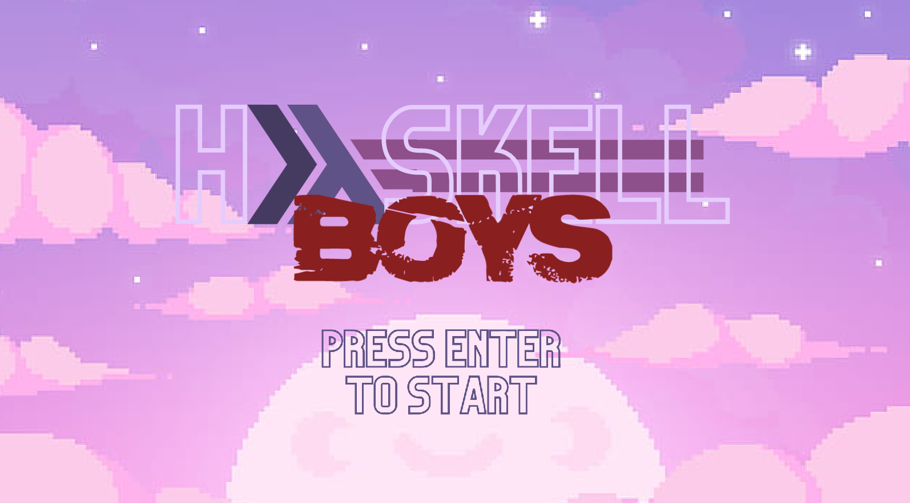
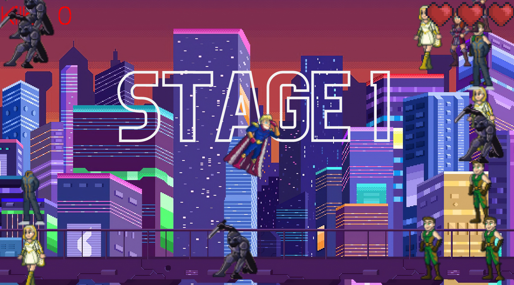

# Haskell Boys

  O projeto trata de um jogo que mistura elementos de asteroids (jogo arcade
com gráficos vetoriais de naves espaciais lançado pela Atari em 1979), ConSumo
(jogo arcade que se encontra dentro do jogo Bully, lançado pela Rockstar em 2006,
onde um lutador de sumô precisa comer sushi e desviar de inimigos e comidas
podres para ficar cada vez maior) e a série The Boys (lançada em 2019 pela
Amazon Prime Video, retrata um mundo onde super-herois existem e os impactos
disso para a realidade atual). No jogo Haskell Boys, o personagem principal é o
personagem Homelander, da série The Boys, e os inimigos são membros do
principal grupo de super herois do mundo (The Seven). O objetivo do jogador é
matar e desviar de todos os inimigos, acumulando pontos e podendo tomar no
máximo 3 hits dos inimigos que estarão se movimentando de forma aleatória pela
tela. O poder de Homelander e a forma de matar os inimigos é através de um laser
lançado por seus olhos.

Requisitos:

- GHCup

Para rodar basta utilizar:

```
stack run
```

<p align="center">
  
  
</p>